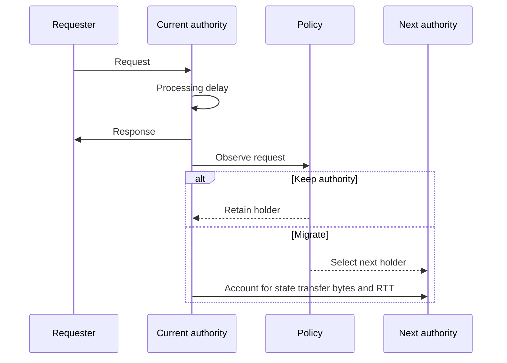

# Authority Placement Policy Evaluation

`nve_policy` reads datasets generated by `nve_dataset` and writes separate outputs
under `output/<policy_id>/`. Policies do not modify the input traces. See the
[README](../README.md) for setup and [Dataset design](DATASET_DESIGN.md) for assumptions.

## 1. Causal replay model

Every policy, including the offline oracle, follows the same ordering:

1. The peer holding authority when a request arrives (`authority_before`) serves it.
2. The policy observes that request and may change authority for later requests.

Each entity's first request is served by its configured `initial_authority`.
The oracle cannot change this initial condition; its advantage is knowledge of
future requests when selecting subsequent holders.



This is a cost-accounting model: migrations are instantaneous in replay. No
requests queue behind a handoff, and no distributed handoff protocol is simulated.

## 2. Explicit evaluation parameters

Required research parameters must be supplied in policy specifications or the
evaluation configuration. Missing required values cause an error.

| Parameter | Meaning | Location |
|---|---|---|
| `type` | Authority-selection policy. | Each policy in `policies.yaml`. |
| `min_holding_time_s` | Minimum time between migrations for policies with a holding-time gate. | Applicable policies. |
| `use_interaction_weight` | Whether demand uses request-type weights. | Window-based policies. |
| `window` | `{type: count, size: N}`, `{type: time, seconds: W}`, or `{type: all}`. | Window-based policies. |
| `migration_penalty_weight` | Migration weight in the oracle objective. | Oracle policy. |
| `request_bytes`, `response_bytes` | Assumed request and response payload sizes. | `evaluation`. |
| `migration_bandwidth_mbps` | Assumed migration bandwidth, or `null`. | `evaluation`. |

Payload sizes and bandwidth are evaluation assumptions. With bandwidth set to
`null`, migration duration is left blank; bytes and network RTT are still reported.

## 3. Latency and cost equations

```text
interaction_latency_ms = RTT(request_peer, authority_before) + processing.delay_ms
migration_bytes = entity.state_size_bytes                         # when migrating
migration_network_latency_ms = RTT(authority_before, authority_after)
migration_duration_ms = migration_network_latency_ms
                        + migration_bytes * 8 / (bandwidth_mbps * 1000)
network_traffic_bytes = request_bytes + response_bytes + migration_bytes
```

The serialization term is in milliseconds and is calculated only when bandwidth
is supplied. Non-migrating requests contribute zero migration bytes. Processing
delay comes from `config_effective.yaml`; network values are round-trip times.

## 4. Implemented policies

| Type | Selection rule | Required policy parameters |
|---|---|---|
| `static` | Keep the initial authority. | None. |
| `nearest` | Select the peer closest to the entity in virtual space, using the most recent position samples. | `min_holding_time_s`. |
| `lowest_rtt` | Minimize demand-weighted RTT to recent requesters. | `window`, `use_interaction_weight`, `min_holding_time_s`. |
| `interaction_aware` | Select the peer with the largest recent request count or weight sum. | Same as `lowest_rtt`. |
| `engagement_aware` | Apply engagement, dwell, and range gates to a configurable selector. | `target_rule`, `relevant_range`, `engagement_threshold`, `dwell_time_s`, `window`, `use_interaction_weight`. |
| `oracle` | Minimize the specified cost with full knowledge of the request sequence. | `migration_penalty_weight`. |

### Lowest RTT with a one-request window

With a count window of one, the requester itself has zero RTT and is the minimum
for the default positive remote RTTs. With no holding-time gate, alternating
requesters therefore cause repeated migrations. A request is served before the
resulting migration, so moving to the latest requester does not necessarily
reduce the next request's latency. This variant is retained to expose that behavior.

### Engagement-aware placement

`target_rule` selects `demand_argmax` (largest demand share) or `rtt_weighted`
(`argmin(demand @ rtt)`). Dwell tracks how long the selected rule has continuously
named the same target; it does not always track the demand argmax.

Engagement is the normalized share `demand[P] / demand.sum()` in `[0, 1]`.
It is computed from the demand window, not read from a dataset engagement column.
Normalizing makes the engagement threshold independent of raw request-count scale.

An out-of-range holder sets a policy-internal ownerless flag. The engine still
retains a concrete authority and serves requests through it because the replay
contract requires `on_request(request, authority) -> int`. Release alone does
not incur migration cost. When an eligible peer is selected, the cost of changing
the actual holder is recorded. This is an approximation, not an implementation
of distributed ownerless operation or consensus.

Candidate selection can occur on the same request as release. Among eligible
peers, the closest is chosen with deterministic tie breaking. If none exists,
the policy remains internally ownerless. The recorded reason distinguishes a
fresh release from continued absence of a candidate.

The decision reasons are `RELEASE_OUT_OF_RANGE`, `KEEP_OWNERLESS_NO_CANDIDATE`,
`CLAIM_OWNERLESS`, `KEEP_SAME_TARGET`, `KEEP_TARGET_OUT_OF_RANGE`,
`KEEP_LOW_ENGAGEMENT`, `KEEP_DWELL_NOT_MET`, and `TRANSFER_TARGET_CHANGE`.

This policy uses a pre-migration dwell condition rather than the post-migration
cooldown of `HoldingTimePolicy`. It inherits directly from `Policy` and shares
the `DemandWindow` helper with the other window-based policies.

### Offline oracle

Each entity can be optimized independently with dynamic programming over
(request index, authority):

```text
dp[i][a] = serve(i, a) + min_b(dp[i-1][b] + alpha * RTT[b][a])
```

Initialization fixes the first serving authority to the dataset's initial holder.
Staying at the same peer costs zero because self RTT is zero. `alpha` defines
the objective: `alpha=0` gives a latency-only lower bound, while positive values
penalize migration RTT. Comparisons require the same objective and initial state.

Complexity is `O(M_e * N^2)` per entity, where `M_e` is its request count and
`N` is the peer count. Tests compare small instances against exhaustive search
for `alpha` values 0, 1, and 10, and check the oracle objective against online
policies across all four scenarios.

## 5. Outputs

`output/<policy_id>/results.csv` contains one row per request:

| Columns | Meaning |
|---|---|
| `timestamp`, `request_id`, `entity_id`, `request_peer` | Request identity and time. |
| `authority_before`, `authority_after` | Serving holder and holder after the decision. |
| `interaction_latency_ms` | Request RTT plus processing delay. |
| `migration_occurred`, `migration_bytes` | Whether the holder changed and the transferred state size. |
| `migration_network_latency_ms` | Migration RTT; blank when no migration occurs. |
| `migration_duration_ms` | RTT plus serialization, when bandwidth is supplied and migration occurs. |
| `network_traffic_bytes` | Request, response, and migration bytes for the row. |

`metrics.json` includes latency mean/median/p95/maximum, migration count and
rates, migration bytes, authority holding times, and total network traffic.
Policies with a decision log also produce `decisions.csv`, containing request
and holder identifiers, `reason`, `target_peer`, `engagement`, `dwell_s`, and
`holder_distance`. It currently applies to `engagement_aware`.

## 6. Usage

Run from the repository root in a shell with glob expansion:

```bash
uv run nve-policy replay datasets/small/*/seed_* --config policies.yaml
uv run nve-policy compare datasets/small/*/seed_* --output datasets/small/policy_comparison.csv
```

## 7. Adding a policy

1. Derive a class from `Policy` or `HoldingTimePolicy` in `nve_policy/policies/`.
2. Register it in `REGISTRY` in `nve_policy/policies/__init__.py`.
3. Make research parameters explicit and validate required values.
4. Add a variant to `policies.yaml`.
5. Keep `requires_future=False` for online policies. Do not inspect requests later than the one passed to `on_request`.

## 8. Interpreting the demonstration suite

The small suite uses 10 peers, 3 entities, 60-second runs, and three seeds.
It exercises policy behavior and the evaluation pipeline; it is not sufficient
evidence for general performance rankings. Long windows can lag shifting demand,
spatial proximity need not improve RTT, and a one-request RTT window can cause
churn. For larger experiments, uncertainty estimates, and held-out evaluation,
use [REPRODUCING.md](../REPRODUCING.md).
